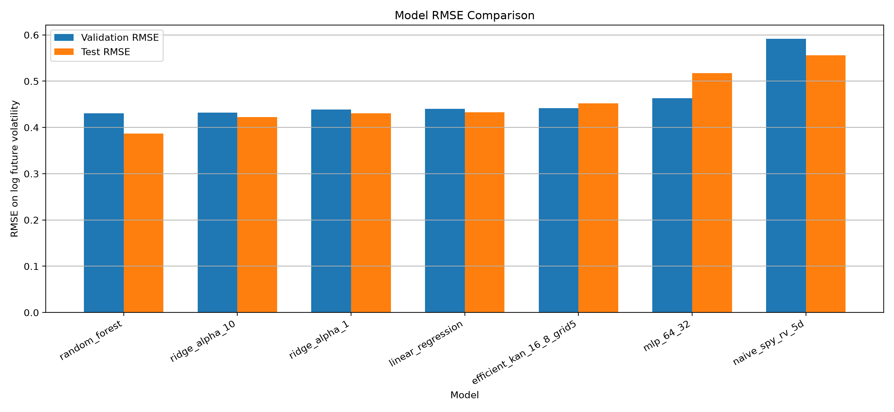
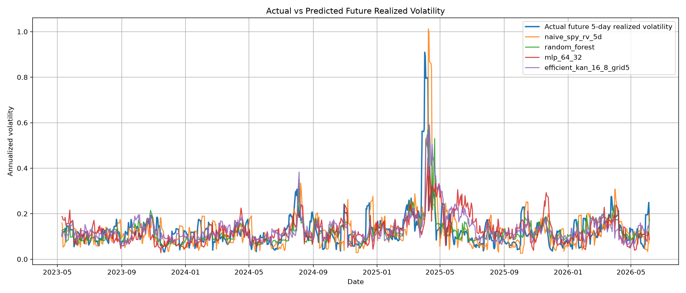
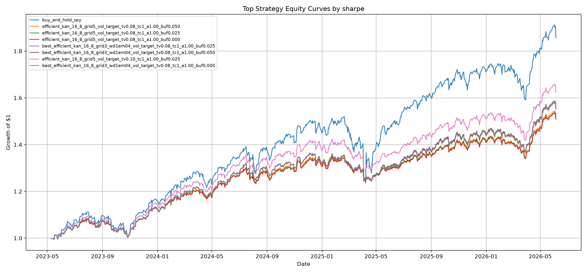
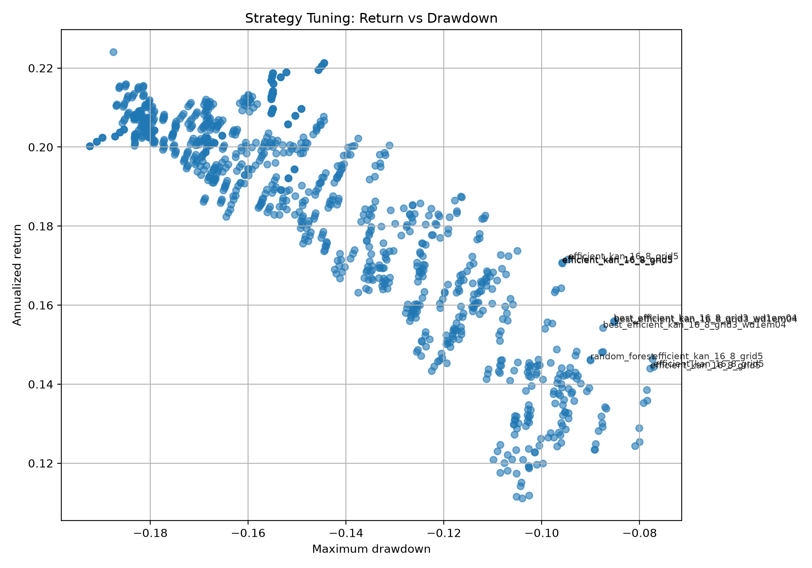
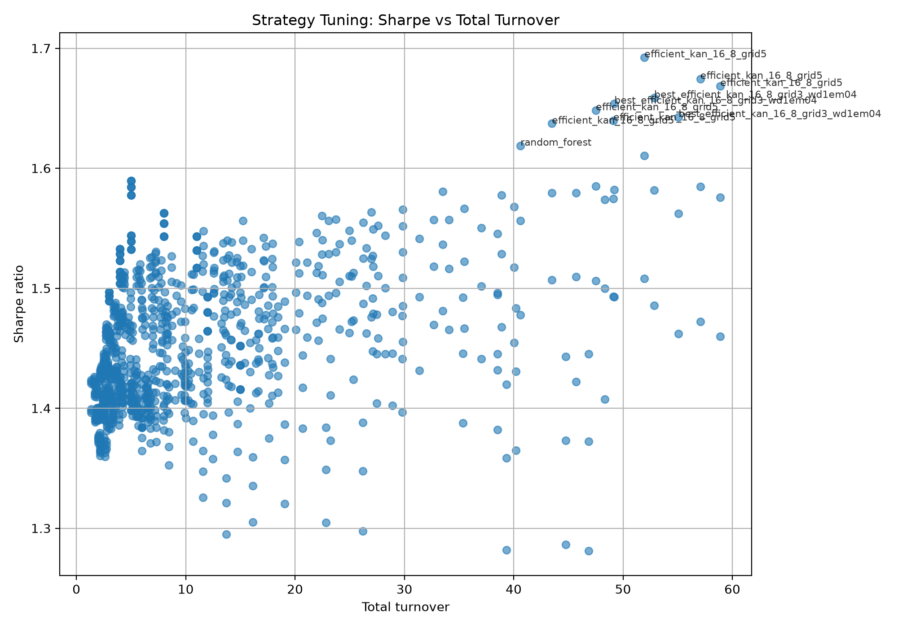

# KAN Volatility Trading

This project investigates whether **Kolmogorov-Arnold Networks**, specifically **EfficientKAN**, can improve realized-volatility forecasting and volatility-based trading strategies on U.S. equity market data.

The project starts from a standard quantitative finance problem:

> Can we forecast future market volatility well enough to improve a simple risk-controlled trading strategy?

The main experiment forecasts 5-day future realized volatility for SPY using engineered market features, compares classical models against neural models, and then tests whether the forecasts improve a volatility-targeting trading strategy.

This project is for research and educational purposes only. It is not financial advice.

---

## Project Overview

The project has two main parts:

1. **Forecasting problem**

   Predict future 5-day annualized realized volatility for SPY.

2. **Trading problem**

   Use the volatility forecasts to adjust SPY exposure through volatility targeting and threshold-based strategies.

The most important finding is that the best forecasting model was not necessarily the best trading model.

The **Random Forest** achieved the best test RMSE for volatility forecasting, but the **EfficientKAN volatility-targeting strategy** achieved the best risk-adjusted trading performance.

---

## Research Question

The core research question is:

> Can EfficientKAN produce useful volatility forecasts for risk-controlled trading, and how does it compare with classical machine-learning models and a standard MLP?

More specifically:

* Can EfficientKAN outperform a standard MLP on tabular financial data?
* Can EfficientKAN compete with Random Forest and Ridge regression?
* Do better forecasting metrics translate into better trading performance?
* Can model-based volatility forecasts reduce drawdown and improve Sharpe ratio compared with buy-and-hold SPY?

---

## Data

The project uses daily historical data for:

| Asset | Description            |
| ----- | ---------------------- |
| SPY   | S&P 500 ETF            |
| QQQ   | Nasdaq-100 ETF         |
| IWM   | Russell 2000 ETF       |
| TLT   | Long-term Treasury ETF |
| GLD   | Gold ETF               |
| VIX   | CBOE Volatility Index  |

The raw data are downloaded with `yfinance`.

The target asset is SPY.

---

## Prediction Target

The prediction target is future 5-day annualized realized volatility:

[
RV_{t,t+5}
==========

\sqrt{
\frac{252}{5}
\sum_{i=1}^{5} r_{t+i}^{2}
}
]

where (r_t) is the daily log return.

The model predicts:

[
\log(RV_{t,t+5})
]

rather than raw volatility, because volatility is strictly positive and the log transform tends to make the regression target easier to model.

---

## Features

The feature set includes information available up to date (t), including:

* 1-day, 5-day, 10-day, 21-day, and 63-day log returns
* 5-day, 10-day, 21-day, and 63-day realized volatility
* Volume-change features
* Volume z-scores
* Moving-average distance features
* VIX level and VIX change features
* Cross-asset features from QQQ, IWM, TLT, and GLD

The dataset is built chronologically to avoid look-ahead bias.

---

## Models Compared

The project compares the following forecasting models:

| Model Type               | Model                                    |
| ------------------------ | ---------------------------------------- |
| Naive baseline           | Current 5-day realized volatility        |
| Linear model             | Linear Regression                        |
| Regularized linear model | Ridge Regression                         |
| Tree ensemble            | Random Forest                            |
| Neural network           | MLP `[64, 32]`                           |
| KAN model                | EfficientKAN `[16, 8]`, grid size 5      |
| Tuned KAN model          | EfficientKAN selected by validation RMSE |

---

## Forecasting Results

Forecasting models were evaluated on a chronological train/validation/test split.

The target is log future 5-day realized volatility.

| Rank | Model                          | Validation RMSE | Test RMSE | Test MAE | Test R² | Test Directional Accuracy |
| ---: | ------------------------------ | --------------: | --------: | -------: | ------: | ------------------------: |
|    1 | Random Forest                  |          0.4304 |    0.3867 |   0.3021 |  0.3293 |                    73.15% |
|    2 | Ridge α=10                     |          0.4321 |    0.4223 |   0.3313 |  0.2004 |                    70.30% |
|    3 | Ridge α=1                      |          0.4386 |    0.4308 |   0.3387 |  0.1677 |                    70.04% |
|    4 | Linear Regression              |          0.4402 |    0.4328 |   0.3408 |  0.1597 |                    69.65% |
|    5 | EfficientKAN `[16, 8]`, grid=5 |          0.4419 |    0.4522 |   0.3639 |  0.0827 |                    69.52% |
|    6 | MLP `[64, 32]`                 |          0.4632 |    0.5175 |   0.4106 | -0.2010 |                    66.41% |
|    7 | Naive RV(5d)                   |          0.5920 |    0.5558 |   0.4296 | -0.3856 |                    46.82% |

The Random Forest was the strongest pure forecasting model. EfficientKAN did not beat the Random Forest or Ridge models on RMSE, but it clearly improved over the MLP and the naive volatility baseline.



The actual-vs-predicted volatility plot shows that all models capture broad volatility regimes but struggle with sharp volatility spikes, which is expected in financial time series.



---

## Trading Strategy

The project then tests whether the volatility forecasts are useful for trading.

The main strategy is a volatility-targeting strategy:

[
w_t
===

\min
\left(
1,
\frac{\sigma_{\text{target}}}{\hat{\sigma}_{t}}
\right)
]

where:

* (w_t) is the SPY portfolio weight,
* (\sigma_{\text{target}}) is the target annualized volatility,
* (\hat{\sigma}_{t}) is the model-predicted annualized volatility.

If predicted volatility is high, the strategy reduces SPY exposure.
If predicted volatility is low, the strategy allows higher SPY exposure up to 100%.

The backtest shifts weights by one trading day to avoid look-ahead bias.

The project also tests threshold strategies, where SPY exposure is reduced only when predicted volatility exceeds a fixed threshold.

---

## Strategy Tuning

The strategy layer was tuned across:

* Target volatility: 8%, 10%, 12%, 15%
* Transaction cost: 1 bps, 5 bps, 10 bps
* Rebalance buffer: 0%, 2.5%, 5%
* Smoothing alpha: 1.0, 0.50, 0.25, 0.10
* Threshold levels: 20%, 25%, 30%

The best strategy by Sharpe ratio was:

```text
efficient_kan_16_8_grid5_vol_target_tv0.08_tc1_a1.00_buf0.050
```

This means:

| Parameter         |                          Value |
| ----------------- | -----------------------------: |
| Model             | EfficientKAN `[16, 8]`, grid=5 |
| Strategy type     |           Volatility targeting |
| Target volatility |                             8% |
| Transaction cost  |                           1 bp |
| Smoothing alpha   |                            1.0 |
| Rebalance buffer  |                             5% |

---

## Best Strategy vs Buy-and-Hold

| Strategy                              | Annualized Return | Annualized Volatility | Sharpe | Sortino | Max Drawdown | Average Weight | Total Turnover |
| ------------------------------------- | ----------------: | --------------------: | -----: | ------: | -----------: | -------------: | -------------: |
| Buy-and-Hold SPY                      |            22.41% |                15.09% |  1.415 |   1.867 |      -18.76% |         99.87% |           1.00 |
| Best EfficientKAN Vol-Target Strategy |            14.63% |                 8.27% |  1.692 |   2.353 |       -7.74% |         67.97% |          51.96 |

The EfficientKAN strategy did not maximize raw return. Buy-and-hold SPY produced higher annualized return.

However, the EfficientKAN volatility-targeting strategy:

* reduced annualized volatility from 15.09% to 8.27%,
* improved Sharpe ratio from 1.415 to 1.692,
* improved Sortino ratio from 1.867 to 2.353,
* reduced maximum drawdown from -18.76% to -7.74%.

This is the strongest result of the project.



---

## Simple Strategy Comparison

The best simple threshold strategy was based on Ridge regression:

| Strategy                      | Annualized Return | Annualized Volatility | Sharpe | Sortino | Max Drawdown | Average Weight | Total Turnover |
| ----------------------------- | ----------------: | --------------------: | -----: | ------: | -----------: | -------------: | -------------: |
| Buy-and-Hold SPY              |            22.41% |                15.09% |  1.415 |   1.867 |      -18.76% |         99.87% |           1.00 |
| Best Ridge Threshold Strategy |            22.13% |                13.12% |  1.590 |   2.146 |      -14.45% |         98.38% |           5.00 |

The Ridge threshold strategy preserved most of the upside of buy-and-hold while modestly reducing volatility and drawdown.

This gives two different strategy profiles:

| Strategy                          | Interpretation                                             |
| --------------------------------- | ---------------------------------------------------------- |
| EfficientKAN volatility targeting | Best defensive strategy and best risk-adjusted performance |
| Ridge threshold strategy          | Simpler, lower-turnover strategy with stronger raw return  |

---

## Strategy Tuning Results

The return-vs-drawdown plot shows the tradeoff between higher returns and drawdown control.



The Sharpe-vs-turnover plot shows that the best EfficientKAN strategies achieved high Sharpe ratios but required higher turnover than simpler threshold strategies.



This matters because high turnover can make a strategy more sensitive to transaction costs and slippage.

---

## Key Findings

| Finding                | Conclusion                                                                                         |
| ---------------------- | -------------------------------------------------------------------------------------------------- |
| Best forecasting model | Random Forest achieved the best test RMSE and MAE.                                                 |
| Best trading model     | EfficientKAN volatility targeting achieved the best Sharpe and Sortino.                            |
| Forecasting vs trading | The best forecasting model was not necessarily the best trading model.                             |
| EfficientKAN result    | EfficientKAN was not the best forecaster, but it produced the best risk-adjusted trading strategy. |
| Simple alternative     | Ridge threshold strategy preserved more upside with much lower turnover.                           |
| Risk control           | EfficientKAN substantially reduced volatility and drawdown compared with buy-and-hold.             |

The central project conclusion is:

> Forecast accuracy and trading utility are related, but not identical. EfficientKAN did not win on pure prediction error, but its forecasts produced the best risk-adjusted volatility-targeting strategy.

---

## Repository Structure

```text
kan-volatility-trading/
├── data/
│   ├── raw/
│   └── processed/
├── docs/
│   └── figures/
├── notebooks/
├── results/
│   ├── figures/
│   ├── tables/
│   └── logs/
├── scripts/
│   ├── 00_check_setup.py
│   ├── 01_download_data.py
│   ├── 02_build_dataset.py
│   ├── 03_train_baselines.py
│   ├── 04_plot_baseline_results.py
│   ├── 05_train_mlp.py
│   ├── 06_compare_models.py
│   ├── 07_train_kan.py
│   ├── 08_tune_kan.py
│   ├── 09_backtest_volatility_strategy.py
│   ├── 10_tune_strategy.py
│   └── 11_generate_report_tables.py
├── src/
│   └── kan_volatility/
│       ├── backtest.py
│       ├── config.py
│       ├── data.py
│       ├── features.py
│       ├── metrics.py
│       ├── strategy.py
│       ├── targets.py
│       └── models/
│           ├── baselines.py
│           ├── kan_model.py
│           └── mlp.py
├── requirements.txt
├── pyproject.toml
└── README.md
```

---

## Reproducing the Project

Create and activate a virtual environment:

```bash
python3 -m venv .venv
source .venv/bin/activate
```

Install dependencies:

```bash
pip install -r requirements.txt
pip install -e .
```

Run the full pipeline:

```bash
python scripts/00_check_setup.py
python scripts/01_download_data.py
python scripts/02_build_dataset.py
python scripts/03_train_baselines.py
python scripts/04_plot_baseline_results.py
python scripts/05_train_mlp.py
python scripts/07_train_kan.py
python scripts/08_tune_kan.py
python scripts/06_compare_models.py
python scripts/09_backtest_volatility_strategy.py
python scripts/10_tune_strategy.py
python scripts/11_generate_report_tables.py
```

---

## Limitations

This project is a research prototype. Several limitations should be considered:

1. **Short test period**

   The test period covers a recent market regime. Results may change across longer or different market regimes.

2. **Daily data only**

   The project uses daily OHLCV data. Intraday volatility features may improve forecast quality.

3. **Transaction costs are simplified**

   The backtest uses simple basis-point transaction costs and does not model bid-ask spreads, slippage, or execution constraints in detail.

4. **No live paper trading yet**

   The current project is a historical backtest. A paper-trading implementation would be needed to evaluate live robustness.

5. **No options data**

   The project forecasts realized volatility, not implied volatility. Options-market data could create a richer volatility modeling problem.

6. **Strategy tuning risk**

   Strategy parameters were tuned on historical results, so further out-of-sample validation is needed.

---

## Future Work

Possible extensions include:

* Walk-forward model retraining
* Paper trading with Alpaca or another broker API
* Multi-asset portfolio allocation
* Forecasting different horizons, such as 1-day, 10-day, and 21-day realized volatility
* Using implied volatility and options-chain data
* Adding GARCH and HAR-RV baselines
* Adding feature-importance and model-interpretability analysis
* Testing KAN feature effects and learned nonlinear relationships
* Stress testing under higher transaction costs and different market regimes
* Optimizing strategy parameters only on validation periods and preserving a final untouched test set

---

## Final Conclusion

This project demonstrates that EfficientKAN can be useful in a quantitative finance setting even when it does not dominate traditional machine-learning models on pure forecasting metrics.

The Random Forest was the best volatility forecaster by test RMSE, but the EfficientKAN volatility-targeting strategy produced the best risk-adjusted trading performance.

The best EfficientKAN strategy improved Sharpe from 1.415 to 1.692 and reduced maximum drawdown from -18.76% to -7.74% compared with buy-and-hold SPY, at the cost of lower raw return and higher turnover.

The main lesson is that in quantitative finance, the best predictive model is not always the best trading model.
